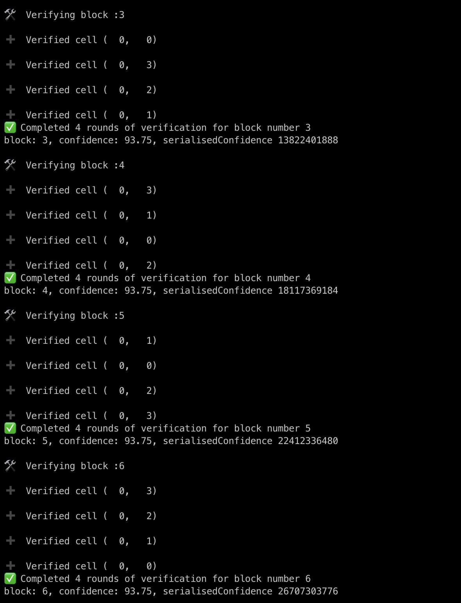

# AVAIL -light-client

Light client for Data Availability Blockchain of Polygon 💻



## Introduction

Naive approach for building one DA light client, which will do following

- Listen for newly mined blocks
- As soon as new block is available, attempts to eventually gain confidence by asking for proof from full client _( via JSON RPC interface )_ for `N` many cells where cell is defined as `{row, col}` pair
- For lower numbered blocks, for which no confidence is yet gained, does batch processing in reverse order i.e. prioritizing latest blocks over older ones

## Installation

- First clone this repo in your local setup
- Create one `.env` file in root of project & put following content

```bash
touch .env
```

```
FullNodeURL=
FullNodeWSURL=
PORT=7000
```

Environment Variable | Interpretation
--- | ---
FullNodeWSURL | Light client subcribes to full node, over **Websocket** transport, for receiving notification, as soon as new block gets mined
FullNodeURL | Light client listens to full node over **HTTP**, for getting the blocks using RPC calls
PORT | Light client exposes RPC server over HTTP, at this port number

- Now, let's run light client

```bash
cargo run
```

## Usage

Given block number ( as _(hexa-)_ decimal number ) returns confidence obtained by light client for this block

```bash
curl -s localhost:7000/v1/confidence/ _block-number_
```

```json
{
    "number": 223,
    "confidence": 99.90234375,
    "serialisedConfidence": "958776730446"
}
```

---

**Note :** Serialised confidence calculated as: 
> `blockNumber << 32 | int32(confidence * 10 ** 7)`, where confidence is represented as out of 10 ** 9


