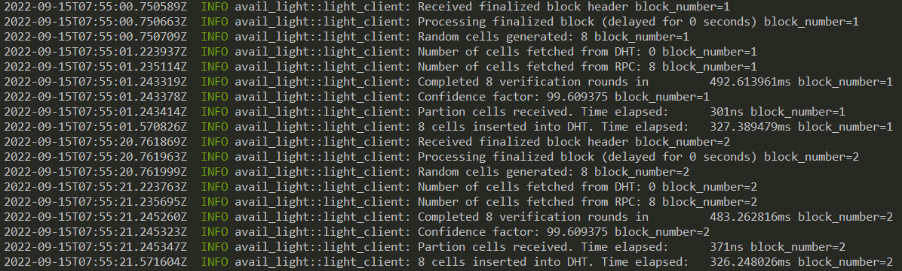

<div align="Center">
<h1>avail-light</h1>
<h3> Light client for the Avail blockchain</h3>
</div>

<br>

[](https://github.com/availproject/avail-light/actions/workflows/default.yml) [](https://codecov.io/gh/availproject/avail-light)



## Introduction

`avail-light` is a data availability light client with the following functionalities:

- Listening on the Avail network for finalized blocks
- Random sampling and proof verification of a predetermined number of cells (`{row, col}` pairs) on each new block. After successful block verification, confidence is calculated for a number of _cells_ (`N`) in a matrix, with `N` depending on the percentage of certainty the light client wants to achieve.
- Data reconstruction through application client.
- HTTP endpoints exposing relevant data, both from the light and application clients

### Modes of Operation

1. **Light-client Mode**: The basic mode of operation and is always active no matter the mode selected. If an `App_ID` is not provided (or is =0), this mode will commence. On each header received the client does random sampling using two mechanisms:

   1. DHT - client first tries to retrieve cells via Kademlia.
   2. RPC - if DHT retrieve fails, the client uses RPC calls to Avail nodes to retrieve the needed cells. The cells not already found in the DHT will be uploaded.

Once the data is received, light client verifies individual cells and calculates the confidence, which is then stored locally.

2. **App-Specific Mode**: If an **`App_ID` > 0** is given in the config file, the application client (part of the light client) downloads all the relevant app data, reconstructs it and persists it locally. Reconstructed data is then available to accessed via an HTTP endpoint. (WIP)

3. **Fat-Client Mode**: The client retrieves larger contiguous chunks of the matrix on each block via RPC calls to an Avail node, and stores them on the DHT. This mode is activated when the `block_matrix_partition` parameter is set in the config file, and is mainly used with the `disable_proof_verification` flag because of the resource cost of cell validation.
   **IMPORTANT**: disabling proof verification introduces a trust assumption towards the node, that the data provided is correct.

4. **Crawl-Client Mode**: Active if the `crawl` feature is enabled, and `crawl_block` parameter is set to `true`. The client crawls cells from DHT for entire block, and calculates success rate. Crawled cell proofs are not being verified, nor rows commitment equality check is being performed. Every block crawling is delayed by `crawl_block_delay` parameter. Delay should be enough so crawling of large block can be compensated. Success rate is emitted in logs and metrics. Crawler can be run in three modes: `cells`, `rows` and `both`. Default mode is `cells`, and it can be configured by `crawl_block_mode` parameter.

## Installation

Download the Light Client from the [releases](https://github.com/availproject/avail-light/releases) page.

Light Client can also be built from the source:

```sh
git clone https://github.com/availproject/avail-light.git
cd avail-light
cargo build --release
```

Resulting `avail-light` binary can be found in the `target/release` directory.

### Installation using Docker

Alternatively, you can use Docker to build and run the light client locally. Keep in mind that Docker image will
fail unless you have provided a `config.yaml` during the build process:

```sh
docker build -t avail-light .
```

It will cache the dependencies on the first build, after which you can run the image like:

```sh
docker run avail-light
```

## Usage

### Local development

For local development, a couple of prerequisites have to be met.

1. Run the Avail [node](https://github.com/availproject/avail). For this setup, we'll run it in `dev` mode:

```sh
./data-avail --dev --enable-kate-rpc
```

2. A [bootstrap](https://github.com/availproject/avail-light-bootstrap) node is required for deploying the Light Client(s) locally. Once the bootstrap has been downloaded and started, run the following command:

```sh
./avail-light --network local
```

Configuration file can also be used for the local deployment, as was the case for the testnet.

Example configuration file:

```yaml
# config.yaml
log_level = "info"
http_server_host = "127.0.0.1"
http_server_port = 7000

secret_key = { seed = "avail" }
port = 37000

full_node_ws = ["ws://127.0.0.1:9944"]
app_id = 0
confidence = 92.0
avail_path = "avail_path"
bootstraps = ["/ip4/127.0.0.1/tcp/39000/p2p/12D3KooWMm1c4pzeLPGkkCJMAgFbsfQ8xmVDusg272icWsaNHWzN"]
```

Full configuration reference can be found [below](#configuration-reference).

_NOTE_
Flags and options take precedence to the configuration file if both are set (i.e. `--port` option overwrites the `port` parameter from the config file).

Example identity file:

_WARNING:_ This file contains a private key. Please ensure only authorized access and prefer using encrypted storage.

```toml
# identity.toml
avail_secret_seed_phrase = "bottom drive obey lake curtain smoke basket hold race lonely fit walk//Alice"
```

## Options

- `--network <NETWORK>`: Select a network for the Light Client to connect. Possible values are:
  - `local`: Local development
- `--config`: Location of the configuration file
- `--identity`: Location of the identity file
- `--app-id`: The `appID` parameter for the application client
- `--port`: LibP2P listener port
- `--verbosity`: Log level. Possible values are:
  - `trace`
  - `debug`
  - `info`
  - `warn`
  - `error`
- `--avail-passphrase <PASSPHRASE>`: Avail secret seed phrase password, flag is optional
- `--seed`: Seed string for libp2p keypair generation
- `--secret-key`: Ed25519 private key for libp2p keypair generation

## Flags

- `--version`: Light Client version
- `--clean`: Remove previous state dir set in `avail_path` config parameter
- `--finality_sync_enable`: Enable finality sync

## Identity

In the Avail network, a light client's identity can be configured using the `identity.toml` file. If not specified, a secret seed phrase will be generated and stored in the identity file when the light client starts. To use an existing seed phrase, set the `avail_secret_seed_phrase` entry in the `identity.toml` file. Seed phrase will be used to derive Sr25519 key pair for signing. Location of the identity file can be specified using `--identity` option.

## Configuration reference

```yaml
log_level = "info"
# Light client HTTP server host name (default: 127.0.0.1)
http_server_host = "127.0.0.1"
# Light client HTTP server port (default: 7000).
http_server_port = 7000
# Secret key for libp2p keypair. Can be either set to `seed` or to `key`.
# If set to seed, keypair will be generated from that seed.
# If set to key, a valid ed25519 private key must be provided, else the client will fail
# If `secret_key` is not set, random seed will be used.
secret_key = { seed={seed} }
# P2P service port (default: 37000).
port = 37000
# Configures AutoNAT behaviour to reject probes as a server for clients that are observed at a non-global ip address (default: false)
autonat_only_global_ips = false
# AutoNat throttle period for re-using a peer as server for a dial-request. (default: 1s)
autonat_throttle = 2
# Interval in which the NAT status should be re-tried if it is currently unknown or max confidence was not reached yet. (default: 20s)
autonat_retry_interval = 20
# Interval in which the NAT should be tested again if max confidence was reached in a status. (default: 360s)
autonat_refresh_interval = 360
# AutoNat on init delay before starting the first probe. (default: 5s)
autonat_boot_delay = 10
# Vector of Light Client bootstrap nodes, used to bootstrap the DHT (mandatory field).
bootstraps = ["/ip4/13.51.79.255/tcp/39000/p2p/12D3KooWE2xXc6C2JzeaCaEg7jvZLogWyjLsB5dA3iw5o3KcF9ds"]
# Vector of Relay nodes, which are used for hole punching
relays = ["/ip4/13.49.44.246/tcp/39111/12D3KooWBETtE42fN7DZ5QsGgi7qfrN3jeYdXmBPL4peVTDmgG9b"]
# WebSocket endpoint of a full node for subscribing to the latest header, etc (default: ws://127.0.0.1:9944).
full_node_ws = ["ws://127.0.0.1:9944"]
# Genesis hash of the network you are connecting to. The genesis hash will be checked upon connecting to the node(s) and will also be used to identify you on the p2p network. If you wish to skip the check for development purposes, entering DEV{suffix} instead will skip the check and create a separate p2p network with that identifier.
genesis_hash = "DEV123"
# ID of application used to start application client. If app_id is not set, or set to 0, application client is not started (default: 0).
app_id = 0
# Confidence threshold, used to calculate how many cells need to be sampled to achieve desired confidence (default: 99.9).
confidence = 99.9
# File system path where RocksDB used by light client, stores its data. (default: avail_path)
avail_path = "avail_path"
# OpenTelemetry Collector endpoint (default: `http://127.0.0.1:4317`)
ot_collector_endpoint = "http://127.0.0.1:4317"
# If set to true, logs are displayed in JSON format, which is used for structured logging. Otherwise, plain text format is used (default: false).
log_format_json = true
# Fraction and number of the block matrix part to fetch (e.g. 2/20 means second 1/20 part of a matrix). This is the parameter that determines whether the client behaves as fat client or light client (default: None)
block_matrix_partition = "1/20"
# Disables proof verification in general, if set to true, otherwise proof verification is performed. (default: false).
disable_proof_verification = false
# Disables fetching of cells from RPC, set to true if client expects cells to be available in DHT (default: false)
disable_rpc = false
# Number of parallel queries for cell fetching via RPC from node (default: 8).
query_proof_rpc_parallel_tasks = 8
# Maximum number of cells per request for proof queries (default: 30).
max_cells_per_rpc = 30
# Maximum number of parallel tasks spawned for GET and PUT operations on DHT (default: 20).
dht_parallelization_limit = 20
# Number of seconds to postpone block processing after the block finalized message arrives. (default: 0).
block_processing_delay = 0
# Starting block of the syncing process. Omitting it will disable syncing. (default: None).
sync_start_block = 0
# Enable or disable synchronizing finality. If disabled, finality is assumed to be verified until the 
# starting block at the point the LC is started and is only checked for new blocks. (default: false)
sync_finality_enable = false
# Time-to-live for DHT entries in seconds (default: 24h).
# Default value is set for light clients. Due to the heavy duty nature of the fat clients, it is recommended to be set far below this value - not greater than 1hr.
# Record TTL, publication and replication intervals are co-dependent: TTL >> publication_interval >> replication_interval.
record_ttl = 86400
# Sets the (re-)publication interval of stored records, in seconds. This interval should be significantly shorter than the record TTL, ensure records do not expire prematurely. (default: 12h).
# Default value is set for light clients. Fat client value needs to be inferred from the TTL value.
# This interval should be significantly shorter than the record TTL, to ensure records do not expire prematurely.
publication_interval = 43200
# Sets the (re-)replication interval for stored records, in seconds. This interval should be significantly shorter than the publication interval, to ensure persistence between re-publications. (default: 3h).
# Default value is set for light clients. Fat client value needs to be inferred from the TTL and publication interval values.
# This interval should be significantly shorter than the publication interval, to ensure persistence between re-publications.
replication_interval = 10800
# The replication factor determines to how many closest peers a record is replicated. (default: 5).
replication_factor = 5
# Sets the amount of time to keep connections alive when they're idle. (default: 30s).
# NOTE: libp2p default value is 10s, but because of Avail block time of 20s the value has been increased
connection_idle_timeout = 30
# Sets the timeout for a single Kademlia query. (default: 10s).
query_timeout = 10
# Sets the allowed level of parallelism for iterative Kademlia queries. (default: 3).
query_parallelism = 3
# Sets the Kademlia caching strategy to use for successful lookups. If set to 0, caching is disabled. (default: 1).
caching_max_peers = 1
# Require iterative queries to use disjoint paths for increased resiliency in the presence of potentially adversarial nodes. (default: false).
disjoint_query_paths = false
# The maximum number of records. (default: 2400000).
max_kad_record_number = 2400000
# The maximum size of record values, in bytes. (default: 8192).
max_kad_record_size = 8192
# The maximum number of provider records for which the local node is the provider. (default: 1024).
max_kad_provided_keys = 1024
```

## Notes

- Immediately after starting a fresh light client, block sync is executed from a starting block set with the `sync_start_block` config parameter. The sync process is using both the DHT and RPC for that purpose.
- In order to spin up a fat client, config needs to contain the `block_matrix_partition` parameter set to a fraction of matrix. It is recommended to set the `disable_proof_verification` to true, because of the resource costs of proof verification.
- `sync_start_block` needs to be set correspondingly to the blocks cached on the connected node (if downloading data via RPC).
- When an LC is freshly connected to a network, block finality is synced from the first block. If the LC is connected to a non-archive node on a long running network, initial validator sets won't be available and the finality checks will fail. In that case we recommend disabling the `sync_finality_enable` flag
- When switching between the networks (i.e. local devnet), LC state in the `avail_path` directory has to be cleared
- OpenTelemetry push metrics are used for light client observability
- In order to use network analyzer, the light client has to be compiled with `--features 'network-analysis'` flag; when running the LC with network analyzer, sufficient capabilities have to be given to the client in order for it to have the permissions needed to listen on socket: `sudo setcap cap_net_raw,cap_net_admin=eip /path/to/light/client/binary`

## Usage and examples

### Fetching the number of the latest block processed by light client

To fetch the number of the latest block processed by light client, we can perform `GET` request on `/v1/latest_block` endpoint.

```sh
curl "http://localhost:7000/v1/latest_block"
```

Response:

```json
{
	"latest_block": 10
}
```

### Fetching the confidence for given block

To fetch the confidence for specific block, which is already processed by application client, we can perform `GET` request on `/v1/confidece/{block_number}` endpoint.

```sh
curl "http://localhost:7000/v1/confidence/1"
```

Response:

```json
{
	"block": 1,
	"confidence": 93.75,
	"serialised_confidence": "5232467296"
}
```

> `serialisedConfidence` is calculated as:
> `blockNumber << 32 | int32(confidence * 10 ** 7)`, where confidence is represented out of 10 ** 9.

### Fetching decoded application data for given block

After data is verified, it can be fetched with `GET` request on `/v1/appdata/{block_number}` endpoint, by specifying `decode=true` query parameter. In case `decode` is omitted or `false`, scale encoded extrinsics will be returned.

#### JSON response

```sh
curl "http://localhost:7000/v1/appdata/1?decode=true"
```

Response:

```json
{
	"block": 46,
	"extrinsics": [
		"ZXhhbXBsZQ=="
	]
}
```

#### Decoded extrinsic

```sh
curl -s "http://127.0.0.1:7000/v1/appdata/1?decode=true" | jq -r '.extrinsics[-1]' | base64 -d
```

Response:

```json
"example"
```

### Get the running mode of the Light Client

```sh
curl "localhost:7000/v1/mode"
```

Response:

```json
{
	"AppClient": 1
}
```

### Get the status of a latest block

```sh
curl "localhost:7000/v1/status"
```

Response:

```json
{
	"block_num": 10,
	"confidence": 93.75,
	"app_id": 1
}
```

### Get the latest block

```sh
curl "localhost:7000/v1/latest_block"
```

Response:

```json
{
	"latest_block": 255
}
```

### Health check

To perform health check of the light client, run:

```sh
curl -I "localhost:7000/health"
```

200 OK is expected response.

## API reference

In case of error, endpoints will return response with `500 Internal Server Error` status code, and descriptive error message.

### **GET** `/v1/mode`

Retrieves the operating mode of the light client. Light client can operate in two different modes, `LightClient` or `AppClient`, depending on configuration of application ID.

#### Responses

If operating mode is `LightClient` response is:

> Status code: `200 OK`

```json
"LightClient"
```

In case of `AppClient` mode, response is:

> Status code: `200 OK`

```json
{"AppClient": {app_id}}
```

### **GET** `/v1/latest_block`

Retrieves the latest block processed by the light client.

#### Responses

> Status code: `200 OK`

```json
{"latest_block":{block_number}}
```

### **GET** `/v1/confidence/{block_number}`

Given a block number, it returns the confidence computed by the light client for that specific block.

> Path parameters:

- `block_number` - block number (required)

#### Responses

In case when confidence is computed:

> Status code: `200 OK`

```json
{ "block": 1, "confidence": 93.75, "serialised_confidence": "5232467296" }
```

If confidence is not computed, and specified block is before the latest processed block:

> Status code: `400 Bad Request`

```json
"Not synced"
```

If confidence is not computed, and specified block is after the latest processed block:

> Status code: `404 Not Found`

```json
"Not found"
```

### **GET** `/v1/appdata/{block_number}`

Given a block number, it retrieves the hex-encoded extrinsics for the specified block, if available. Alternatively, if specified by a query parameter, the retrieved extrinsic is decoded and returned as a base64-encoded string.

> Path parameters:

- `block_number` - block number (required)

> Query parameters:

- `decode` - `true` if decoded extrinsics are requested (boolean, optional, default is `false`)

#### Responses

If application data is available, and decode is `false` or unspecified:

> Status code: `200 OK`

```json
{
	"block": 1,
	"extrinsics": [
		"0xc5018400d43593c715fdd31c61141abd04a99fd6822c8558854ccde39a5684e7a56da27d01308e88ca257b65514b7b44fc1913a6a9af6abc34c3d22761b0e425674d68df7de26be1c8533a7bbd01fdb3a8daa5af77df6d3fb0a67cde8241f461f4fe16f188000000041d011c6578616d706c65"
	]
}
```

If application data is available, and decode is `true`:

> Status code: `200 OK`

```json
{ "block": 1, "extrinsics": ["ZXhhbXBsZQ=="] }
```

If application data is not available, and specified block is the latest block:

> Status code: `401 Unauthorized`

```json
"Processing block"
```

If application data is not available, and specified block is not the latest block:

> Status code: `404 Not Found`

```json
"Not found"
```

### **GET** `/v1/status`

Retrieves the status of the latest block processed by the light client.

> Path parameters:

- `block_number` - block number (required)

#### Responses

If latest processed block exists, and `app_id` is configured (otherwise, `app_id` is not set):

> Status code: `200 OK`

```json
{ "block_num": 89, "confidence": 93.75, "app_id": 1 }
```

If there are no processed blocks:

> Status code: `404 Not Found`

```json
"Not found"
```

## Test Code Coverage Report

We are using [grcov](https://github.com/mozilla/grcov) to aggregate code coverage information and generate reports.

To install grcov, run:

```bash
cargo install grcov
```

Source code coverage data is generated when running tests with:

```bash
env RUSTFLAGS="-C instrument-coverage" \
 LLVM_PROFILE_FILE="tests-coverage-%p-%m.profraw" \
 cargo test
```

To generate the report, run:

```bash
grcov . -s . \
 --binary-path ./target/debug/ \
 -t html \
 --branch \
 --ignore-not-existing -o \
 ./target/debug/coverage/
```

To clean up generate coverage information files, run:

```bash
find . -name \*.profraw -type f -exec rm -f {} +
```

Open `index.html` from the `./target/debug/coverage/` folder to review coverage data.
