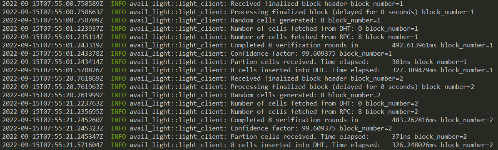

<div align="Center">
<h1>avail-light-client</h1>
<h3> Light client for the Avail blockchain</h3>
</div>

<br>



## Introduction

`avail-light` is a data availability light client with the following functionalities:

- Listening on the Avail network for finalized blocks
- Random sampling and proof verification of a predetermined number of cells (`{row, col}` pairs) on each new block. After successful block verification, confidence is calculated for a number of _cells_ (`N`) in a matrix, with `N` depending on the percentage of certainty the light client wants to achieve.
- Data reconstruction through application client.
- HTTP endpoints exposing relevant data, both from the light and application clients

### Modes of Operation

1. **Light-client Mode**: The basic mode of operation and is always active no matter the mode selected. If an `App_ID` is not provided (or is =0), this mode will commence. On each header received the client does random sampling using two mechanisms:

   1. DHT - client first tries to retrieve cells via Kademlia (can be disabled by setting `network_mode` to `rpc_only`).
   2. RPC - if DHT retrieve fails, the client uses RPC calls to Avail nodes to retrieve the needed cells. The cells not already found in the DHT will be uploaded (can be disabled by setting `network_mode` to `p2p_only`).

Once the data is received, light client verifies individual cells and calculates the confidence, which is then stored locally.

2. **App-Specific Mode**: If an **`App_ID` > 0** is given in the config file, the application client (part of the light client) downloads all the relevant app data, reconstructs it and persists it locally. Reconstructed data is then available to access via an HTTP endpoint. (WIP)

3. **Fat-Client Mode**: The client retrieves larger contiguous chunks of the matrix on each block via RPC calls to an Avail node, and stores them on the DHT. This mode is activated when the `block_matrix_partition` parameter is set in the config file, and is mainly used with the `disable_proof_verification` flag because of the resource cost of cell validation.
   **IMPORTANT**: disabling proof verification introduces a trust assumption towards the node, that the data provided is correct.

4. **Crawl-Client Mode**: Active if the `crawl` feature is enabled, and `crawl_block` parameter is set to `true`. The client crawls cells from DHT for entire block, and calculates success rate. Crawled cell proofs are not being verified, nor rows commitment equality check is being performed. Every block crawling is delayed by `crawl_block_delay` parameter. Delay should be enough so crawling of large block can be compensated. Success rate is emitted in logs and metrics. Crawler can be run in three modes: `cells`, `rows` and `both`. Default mode is `cells`, and it can be configured by `crawl_block_mode` parameter.

## Installation

Download the Light Client from the [releases](https://github.com/availproject/avail-light/releases) page.

Light Client can also be built from the source:

```sh
git clone https://github.com/availproject/avail-light.git
cd avail-light
cargo build --release
```

Resulting `avail-light` binary can be found in the `target/release` directory.

### Installation using Docker

Alternatively, you can use Docker to build and run the light client locally. Keep in mind that Docker image will
fail unless you have provided a `config.yaml` during the build process:

```sh
docker build -t avail-light .
```

It will cache the dependencies on the first build, after which you can run the image like:

```sh
docker run avail-light
```

## Usage

### Local development

For local development, a couple of prerequisites have to be met.

1. Run the Avail [node](https://github.com/availproject/avail). For this setup, we'll run it in `dev` mode:

```sh
./data-avail --dev --enable-kate-rpc
```

2. A [bootstrap](https://github.com/availproject/avail-light-bootstrap) node is required for deploying the Light Client(s) locally. Once the bootstrap has been downloaded and started, run the following command:

```sh
./avail-light --network local
```

Configuration file can also be used for the local deployment, as was the case for the testnet.

Example configuration file:

```yaml
# config.yaml
log_level = "info"
http_server_host = "127.0.0.1"
http_server_port = 7007

secret_key = { seed = "avail" }
port = 37000

full_node_ws = ["ws://127.0.0.1:9944"]
app_id = 0
confidence = 92.0
avail_path = "avail_path"
bootstraps = ["/ip4/127.0.0.1/tcp/39000/p2p/12D3KooWMm1c4pzeLPGkkCJMAgFbsfQ8xmVDusg272icWsaNHWzN"]
```

Full configuration reference can be found [below](#configuration-reference).

_NOTE_
Flags and options take precedence to the configuration file if both are set (i.e. `--port` option overwrites the `port` parameter from the config file).

Example identity file:

_WARNING:_ This file contains a private key. Please ensure only authorized access and prefer using encrypted storage.

```toml
# identity.toml
avail_secret_seed_phrase = "bottom drive obey lake curtain smoke basket hold race lonely fit walk//Alice"
```

## Options

- `--network <NETWORK>`: Select a network for the Light Client to connect. Possible values are:
  - `mainnet`: Mainnet
  - `turing`: Turing testnet
  - `local`: Local development
- `--config`: Location of the configuration file
- `--identity`: Location of the identity file
- `--app-id`: The `appID` parameter for the application client
- `--port`: LibP2P listener port
- `--network-mode <MODE>`: Select how the client fetches data. Possible values are:
  - `both`: Use both P2P and RPC for data retrieval (default)
  - `p2p_only`: Use only P2P for data retrieval (RPC disabled)
  - `rpc_only`: Use only RPC for data retrieval (P2P disabled)
- `--verbosity`: Log level. Possible values are:
  - `trace`
  - `debug`
  - `info`
  - `warn`
  - `error`
- `--avail-suri <SECRET_URI>`: Avail secret URI, flag is optional, overrides secret URI from identity file
- `--avail-passphrase <PASSPHRASE>`: Avail secret seed phrase password, flag is optional
- `--seed`: Seed string for libp2p keypair generation
- `--secret-key`: Ed25519 private key for libp2p keypair generation
- `--operator-address <ADDRESS>`: Set the address of the Light Client operator

## Flags

- `--version`: Light Client version
- `--clean`: Remove previous state dir set in `avail_path` config parameter
- `--finality_sync_enable`: Enable finality sync
- `--no-update`: Don't update light client if update is available (default: false)

## Identity

In the Avail network, a light client's identity can be configured using the `identity.toml` file. If not specified, a secret URI will be generated and stored in the identity file when the light client starts. To use an existing secret URI, set the `avail_secret_uri` entry in the `identity.toml` file. Secret URI will be used to derive Sr25519 key pair for signing. Location of the identity file can be specified using `--identity` option. Parameter `avail_secret_seed_phrase` is deprecated and replaced with `avail_secret_uri`. More info can be found on [Substrate URI documentation](https://polkadot.js.org/docs/keyring/start/suri/).

Since identity is stored in plain-text, to improve security, `--avail-passphrase` CLI parameter should be used. For maximum security, avoid using identity file and pass Secret URI through `--avail-suri` CLI parameter.

## Updates

The light client periodically checks for newly released versions and will perform an automatic update unless the updater is disabled using the `--no-update` flag.
Self-update requires certain permissions to replace the binary and restart the application.
To use the self-update feature on Windows, run the light client from a folder that allows file replacement (e.g., `AppData\Local`).

## Configuration reference

```yaml
log_level = "info"
# Light client HTTP server host name (default: 127.0.0.1)
http_server_host = "127.0.0.1"
# Light client HTTP server port (default: 7007).
http_server_port = 7007
# Secret key for libp2p keypair. Can be either set to `seed` or to `key`.
# If set to seed, keypair will be generated from that seed.
# If set to key, a valid ed25519 private key must be provided, else the client will fail
# If `secret_key` is not set, random seed will be used.
secret_key = { seed={seed} }
# P2P TCP/UDP listener port (default: 37000).
port = 37000
# P2P WebRTC listener port (default: 37001).
webrtc_port = 37001
# Vector of Light Client bootstrap nodes, used to bootstrap the DHT (mandatory field).
bootstraps = ["/ip4/13.51.79.255/tcp/39000/p2p/12D3KooWE2xXc6C2JzeaCaEg7jvZLogWyjLsB5dA3iw5o3KcF9ds"]
# WebSocket endpoint of a full node for subscribing to the latest header, etc (default: ws://127.0.0.1:9944).
full_node_ws = ["ws://127.0.0.1:9944"]
# Genesis hash of the network you are connecting to. The genesis hash will be checked upon connecting to the node(s) and will also be used to identify you on the p2p network. If you wish to skip the check for development purposes, entering DEV{suffix} instead will skip the check and create a separate p2p network with that identifier.
genesis_hash = "DEV123"
# ID of application used to start application client. If app_id is not set, or set to 0, application client is not started (default: 0).
app_id = 0
# Confidence threshold, used to calculate how many cells need to be sampled to achieve desired confidence (default: 99.9).
confidence = 99.9
# File system path where RocksDB used by light client, stores its data. (default: avail_path)
avail_path = "avail_path"
# OpenTelemetry Collector endpoint (default: `http://127.0.0.1:4317`)
ot_collector_endpoint = "http://127.0.0.1:4317"
# If set to true, logs are displayed in JSON format, which is used for structured logging. Otherwise, plain text format is used (default: false).
log_format_json = true
# Fraction and number of the block matrix part to fetch (e.g. 2/20 means second 1/20 part of a matrix). This is the parameter that determines whether the client behaves as fat client or light client (default: None)
block_matrix_partition = "1/20"
# Disables proof verification in general, if set to true, otherwise proof verification is performed. (default: false).
disable_proof_verification = false
# Network mode: 'both' uses P2P and RPC, 'p2p_only' disables RPC, 'rpc_only' disables P2P (default: both)
network_mode = "both"
# Number of parallel queries for cell fetching via RPC from node (default: 8).
query_proof_rpc_parallel_tasks = 8
# Maximum number of cells per request for proof queries (default: 30).
max_cells_per_rpc = 30
# Number of seconds to postpone block processing after the block finalized message arrives. (default: 20).
block_processing_delay = 0
# Starting block of the syncing process. Omitting it will disable syncing. (default: None).
sync_start_block = 0
# Enable or disable synchronizing finality. If disabled, finality is assumed to be verified until the
# starting block at the point the LC is started and is only checked for new blocks. (default: false)
sync_finality_enable = false
```

## Notes

- Immediately after starting a fresh light client, block sync is executed from a starting block set with the `sync_start_block` config parameter. The sync process is using both the DHT and RPC for that purpose.
- In order to spin up a fat client, config needs to contain the `block_matrix_partition` parameter set to a fraction of matrix. It is recommended to set the `disable_proof_verification` to true, because of the resource costs of proof verification.
- `sync_start_block` needs to be set correspondingly to the blocks cached on the connected node (if downloading data via RPC).
- When an LC is freshly connected to a network, block finality is synced from the first block. If the LC is connected to a non-archive node on a long running network, initial validator sets won't be available and the finality checks will fail. In that case we recommend disabling the `sync_finality_enable` flag
- When switching between the networks (i.e. local devnet), LC state in the `avail_path` directory has to be cleared
- OpenTelemetry push metrics are used for light client observability
- In order to use network analyzer, the light client has to be compiled with `--features 'network-analysis'` flag; when running the LC with network analyzer, sufficient capabilities have to be given to the client in order for it to have the permissions needed to listen on socket: `sudo setcap cap_net_raw,cap_net_admin=eip /path/to/light/client/binary`
- To use RocksDB as persistent Kademlia store, compile `avail-light` binary with `--features "kademlia-rocksdb` on.

## API

API usage and examples can be found on the [Avail Docs](https://docs.availproject.org/docs/operate-a-node/run-a-light-client/light-client-api-reference).

### API Version 2

API V2 reference can be found in the [V2 README file](src/api/v2/README.md).

### API Version 1 (deprecated)

API V1 reference can be found in the [V1 README file](src/api/v1/README.md).

## Test Code Coverage Report

We are using [grcov](https://github.com/mozilla/grcov) to aggregate code coverage information and generate reports.

To install grcov, run:

```bash
cargo install grcov
```

Source code coverage data is generated when running tests with:

```bash
env RUSTFLAGS="-C instrument-coverage" \
 LLVM_PROFILE_FILE="tests-coverage-%p-%m.profraw" \
 cargo test
```

To generate the report, run:

```bash
grcov . -s . \
 --binary-path ./target/debug/ \
 -t html \
 --branch \
 --ignore-not-existing -o \
 ./target/debug/coverage/
```

To clean up generate coverage information files, run:

```bash
find . -name \*.profraw -type f -exec rm -f {} +
```

Open `index.html` from the `./target/debug/coverage/` folder to review coverage data.
